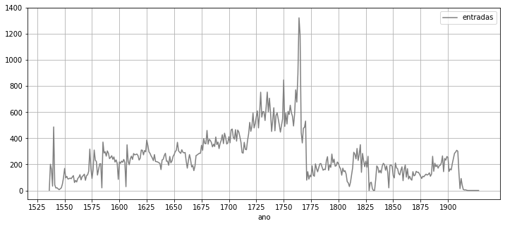

# FAUC-1537-1919

**[PT]** Português

---

**[EN]** English

## O ficheiro dos alunos da Universidade de Coimbra (1537-1919): uma abordagem de ciência de dados aberta

----

## The student records of the University of Coimbra (1537-1919): an Open Data Science approach

Como citar:

    CARVALHO, Joaquim - FAUC-1537-1919 [Em linha] [Consult. 11 mai. 2022]. 
    Disponível em WWW:<URL:https://github.com/joaquimrcarvalho/fauc1537-1919>.

---

How to quote:

    Carvalho, Joaquim. (2022) 2022. FAUC-1537-1918. Python, Jupyter Notebook. https://github.com/joaquimrcarvalho/fauc1537-1919.

## O que contém este repositório

Este repositório contém software e ficheiros de dados relacionados com 
o "Índice dos Alunos da Universidade de Coimbra (1537 a 1919)"
também conhecido como "Ficheiro de alunos" ,
disponível em linha em http://pesquisa.auc.uc.pt/details?id=264605.

A informação do catálogo foi tratada com o objetivo de extrair atributos 
específicos dos estudantes e do seu percurso académico, o que permite 
efectuar vários tipos de índices, contagens e processamentos estatísticos. 
Atualmente é possível extrair, com graus variáveis de cobertura e precisão, 
informações dos estudantes relativas a ano de entrada, último ano presente 
nos registos, origem geográfica, filiação, título pessoal, ordem religiosa, 
colégio, faculdade, matrículas, graus e exames. Para cada tipo de informação 
é possível obter listagens de nomes com várias combinações de variáveis. 

_Este repositório é independente do Arquivo da Universidade de Coimbra e os seus conteúdos são da exclusiva responsabilidade do autor._

Tipo de conteúdos

* _pacote_ Python [ucalumni](notebooks/ucalumni/) capaz de processar uma 
  cópia do catálogo online e extrair vários atributos relacionados com os 
  estudantes a partir dos campos de texto semi-estruturado.
* Um conjunto de [notebooks](notebooks) que fornecem controlo de qualidade, 
  estratégias exploratórias e geração 
  de tabelas e outras informações derivadas. 
  Exemplo: [Alunos - evolução](notebooks/020-students_overview.ipynb)
* Várias [inferências](inferences) sob a forma de listas de estudantes 
  com atributos específicos derivados de _interpretações_ da informação original. 
  Por exemplo, [Ordens Religiosas](inferences/name-notes/religious-orders.csv)
* Conjuntos de dados auxiliares para controlo de qualidade, 
   tratamento de referências cruzadas e normalização.

---

## What is in this repository

This repository  contains software and data files related to the 
catalogue of the students of the University of Coimbra, Portugal,
("Índice dos Alunos da Universidade de Coimbra (1537-1919)"),
also known as "Ficheiro de alunos", 
available online at http://pesquisa.auc.uc.pt/details?id=264605 .

The catalog information has been processed with the aim of extracting
 information about specific variables of the students and their academic 
 path, which allows various types of indexes, counts and statistical 
 processing to be carried out. Currently it is possible to extract, 
 with varying degrees of coverage and accuracy, information regarding 
 year of entry, last year present in the records, geographical origin, 
 family, personal titles, religious order, college, faculty, enrollments, 
 degrees , exams. For each type of information it is possible to 
 obtain lists of names with various combinations of variables.

_This site is independent of the Archives of the University of Coimbra and its contents are the sole responsibility of the author._

Content types

* Python package [ucalumni](notebooks/ucalumni/) that can process a copy of the of
  the online catalog and extract various attributes related to the students.
* A set of [notebooks](notebooks) that provide quality control, 
  exploratory strategies and generation 
  of tables and other derived inferred from the the original. 
  Example: [Students - evolution](notebooks/020-students_overview.ipynb)
* Various [inferences](inferences/README.md) in the form of listings of 
  students, statistical information and visualizations.
  For instance, [Ordens Religiosas](inferences/name-notes/religious-orders.csv)
* Auxiliary datasets for quality control, treatment of cross-references and normalization.
  

## Como contribuir

Se considerar este projecto útil e desejar contribuir, existem diversas formas de o fazer:

* Melhorar a documentação, incluindo tradução.
* Validar o resultado dos algoritmos de inferência.
* Assinalar erros na informação do catálogo original.

 Para reportar erros e outros problema veja [Reportar um problema](https://docs.github.com/pt/issues/tracking-your-work-with-issues/creating-an-issue) 
 (versão portuguesa disponível) e use os formulários disponíveis em https://github.com/joaquimrcarvalho/fauc1537-1919/issues.

---

## How to contribute

If you consider this project useful and wish to help, there are several ways to contribute:

* Improve the documentation, including translation.
* Help validating the algorithmic inferences.
* Report errors in the original records.

To report errors look at
[Creating an issue](https://docs.github.com/en/issues/tracking-your-work-with-issues/creating-an-issue) 
and use the predefined templates at https://github.com/joaquimrcarvalho/fauc1537-1919/issues.

## Licença

_Os **ficheiros de dados e blocos de notas Jupyter** são disponibilizados nos termos da licença Creative Commons Attribution-NonCommmercial-ShareAlike 4.0 International
 _

Salvo indicação em contrário a atribuição deve ser: CARVALHO, Joaquim - FAUC-1537-1919 [Em linha]. 
        Disponível em WWW:<URL:https://github.com/joaquimrcarvalho/fauc1537-1919>. 

 _O **software** (ficheiros ".py") é disponibilizado nos termos da [MIT License](https://opensource.org/licenses/MIT)._

---
## License 

_**Data files and Jupyter notebooks** are licensed under the_ Creative Commons Attribution-NonCommmercial-ShareAlike 4.0 International  

Unless specified otherwise attribution should be __Carvalho, Joaquim. (2022) 2022. FAUC-1537-1918. Python, Jupyter Notebook. https://github.com/joaquimrcarvalho/fauc1537-1919.__ 

 _The **software** (files ".py" )is distributed under the [MIT License](https://opensource.org/licenses/MIT)._

